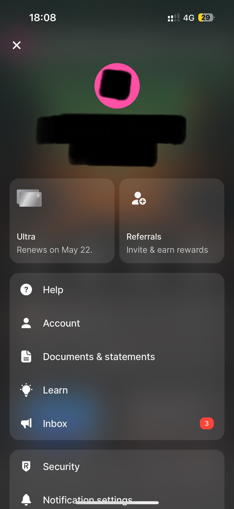
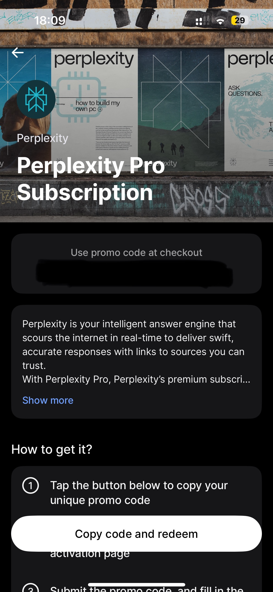

:::note[About this guide]
_Target audience:_ General users 
_Type:_ Step-by-step guide
:::

# How to activate Revolut Ultra subscription for Perplexity Pro?

:::warning
To start this guide, you should already have an active Revolut Ultra subscription.
:::

## Registrate or log in to your Perplexity account
1. Visit https://www.perplexity.ai/ or download and start the Perplexity application. When visiting the link, you will see a page like this:

Perplexity works without registration as well, but to activate Pro, you need an active account.
1. Click the Registration button on the down left corner of the page to create a Perplexity account.
Or log in by clicking the Log in button on the down left corner of the page if you already have an account.
After clicking Registration, you will see a page like this:

1. Choose the option you want to use (if you are unsure on how to choose, you can find more info here: https://www.perplexity.ai/hub/faq/log-in-account).  After you logged in successfully, you can see your account name in the left corner of the page:

## Go to upgrade page on Perplexity
4. TODO: reproduce screenshots
1. TODO

## Get you Ultra code
6. Open and log in to your Revolut app in your phone:

1. Tap the colorful circle at the upper left side. This will bring up a new page showing you account information and your subscription type:

1. Tap the Ultra subscription box. This will bring up detailed information about your Ultra subscription:

1. Tap "See all" at "Included with Ultra" to bring up Perplexity Pro Subscription:

1. Tap Perplexity to bring up the promo code for Perplexity Pro:

## Get your Perplexity Pro
11. TODO: reproduce the screenshots
1. Copy the code to Perplexity and tap or click redeem. The price will go down to 0.
1. Fill in the necessary card and billing information and click or tap pay.
1. You will see a window greeting you at Perplexity Pro:

## ... and you are ready!

---

## What's next?
- <a href="https://www.revolut.com/ultra-plan/"> How to get Revolut Ultra?
- <a href="https://www.perplexity.ai/hub/faq/what-is-perplexity"> What is Perplexity?
- <a href="https://www.perplexity.ai/hub/faq/what-should-i-use-perplexity-for"> How can I use Perplexity?

