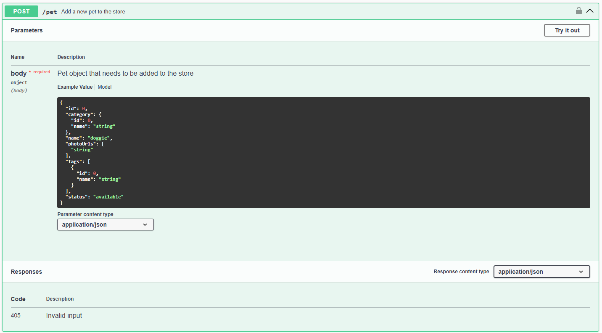
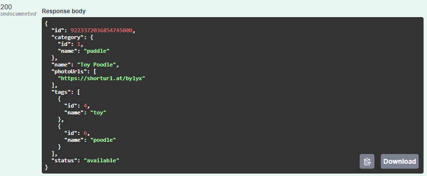
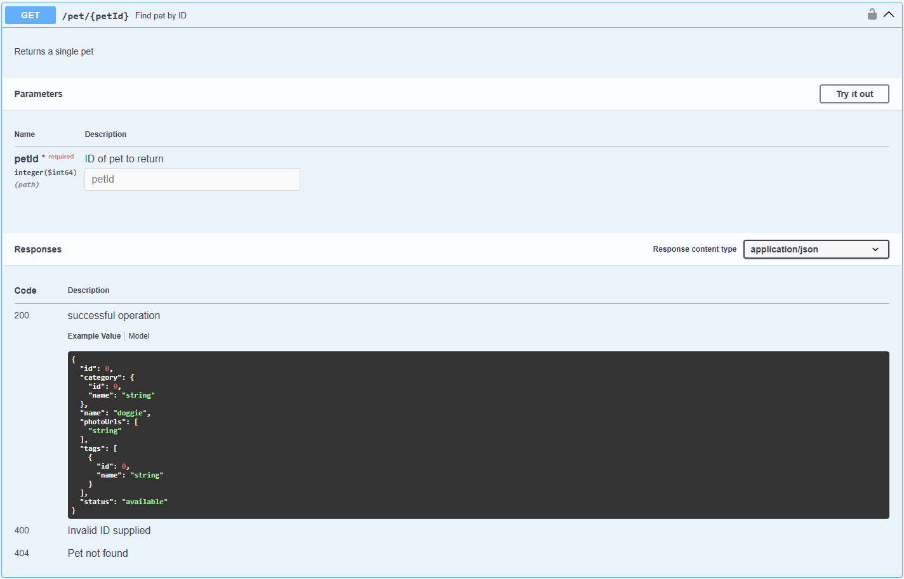
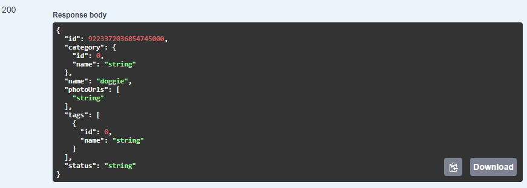
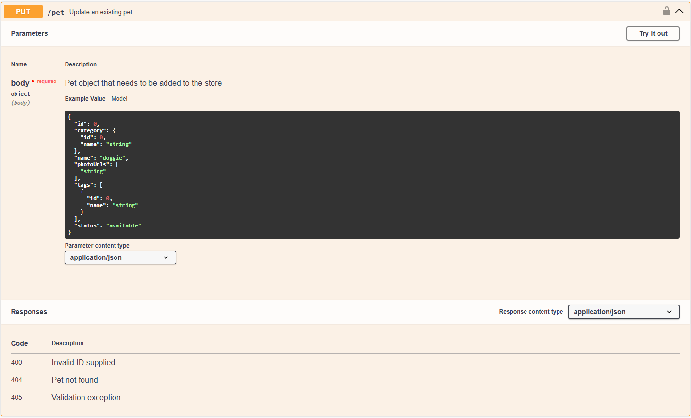
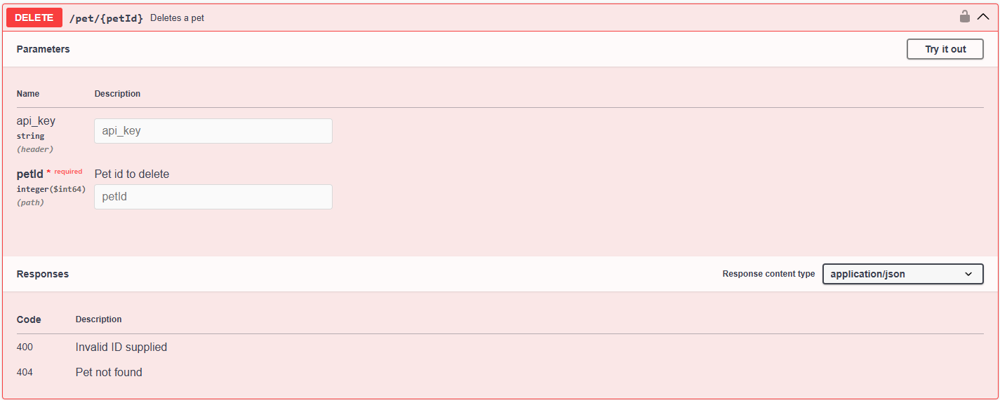
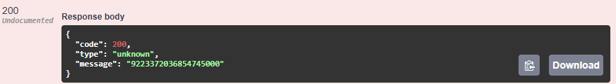

:::note[About this guide]
_Target audience:_ General users<br>
_Type:_ Step-by-step guide
:::

## Bevezetés

Ez az útmutató bemutatja, hogyan lehet új kisállatot létrehozni, adatokat lekérdezni, frissíteni, és törölni a Petstore API segítségével. Az útmutató célja, hogy lépésről lépésre vezesse végig a felhasználót az API használatán.

Az útmutató célja, hogy egyszerű és érthető módon segítse a felhasználót az API funkcióinak megértésében és használatában.

# Gyors áttekintés
| Lépés | Funkció                                 | Végpont             | Link |
|-------|-----------------------------------------|---------------------|----------|
| 1.    | Új kisállat létrehozása                | POST `/pet`         | https://petstore.swagger.io/#/pet/addPet |
| 2.    | Kisállat adatainak lekérdezése          | GET `/pet/{petId}`  | https://petstore.swagger.io/#/pet/getPetById |
| 3.    | Kisállat adatainak frissítése           | PUT `/pet`          | https://petstore.swagger.io/#/pet/updatePet |
| 4.    | Kisállat törlése                        | DELETE `/pet/{petId}`| https://petstore.swagger.io/#/pet/deletePet |


# Lépések részletes bontása:

## 0. Előkészületek
1. Nyisd meg a https://petstore.swagger.io/ oldalt.
## 1. Új kisállat (Pet) létrehozása
1. Tekerj az oldalon a `POST /pet` parancshoz.
1. Nyisd le a parancsot a jobb oldalon található nyíllal

1. A `Parameters` rész alatt láthatod a kérés törzsét. Itt találsz egy példa bemenetet és a bemenet felépítését bemutató modellt is. A legördülő menüből kiválaszthatod, hogy json vagy xml formátumban szeretnéd beküldeni a kérés törzsét.
1. A paraméterek alatt találod a `Responses` részt, ami a lehetséges válaszkódokat sorolja fel. Az érvénytelen bemenetre `405 Invalid input` választ ad az oldal. Az érvényes bemenetre adott válasz itt nincs dokumentálva, de az egyezményes válasz a `200`.
1. Próbáld ki a parancsot! Ehhez tekerj vissza a kérés elejére és kattins a `Try it out` gombra. Ez a gomb szerkeszthetővé teszi a kérés paramétereit, jelen esetben a kérés törzsét.
1. Másold be a következő kódot a szerkeszthető mezőbe:
```json
{
  "id": 0,
  "category": {
    "id": 1,
    "name": "puddle"
  },
  "name": "Toy Poodle",
  "photoUrls": [
    "https://shorturl.at/bylyx"
  ],
  "tags": [
    {
      "id": 4,
      "name": "toy"
    },
    {
      "id": 6,
      "name": "poodle"
    }
  ],
  "status": "available"
}
```
>TIPPEK
>- Az `id` értéke - API konfigurációtól függően - lehet `0`, egy konkrét érték, vagy előfordulhat, hogy meg sem kell adni. A példában az `id` értékét `0`-n hagytuk. Egy ismeretlen
>- A `category` és a `tags` résznél olyan `id`-kat adtunk meg, amiket feltételeztünk, hogy létezik. Ha nem létező `id`-t adsz meg, előfordulhat, hogy az API létrehozza - API-től függően - kaphatunk vissza hibát vagy létre is hozhatja új objektumként. 
>A photo URL-t interneten találtam és a shorturl segítségével rövidítettem le.<br>
1. Figyeljünk rá, hogy a formázás helyes legyen.
1. Kattinstunk az Execute gombra.
1. A gomb alatt megjelenik a curl parancs, amit beküdltünk az execute gombbal és a request URL, amit használtunk. Ez alatt látjuk a választ, amit kaptunk:

1. Ez azt jelenti, hogy sikeresen hozzáadtuk a kisállatunkat.
## 2. Létrehozott kisállat adatainak lekérdezése: (GET /pet/{petId}) [link](#2-létrehozott-kisállat-adatainak-lekérdezése-get-petpetid-link)
1. Tekerjünk lejjebb az oldalon a kék **GET /pet/{petId}** parancsig.

1. A kérés felépítése hasonló, de a törzs helyett itt egy paramétert látunk, az id-t.
1. A lehetséges válaszok között megjelennek más opciók is: 200 OK, 400 érvénytelen id, 404 not found
1. Írjuk be az előbb létrehozott állat id-ját. 
>TIPP: mivel ez egy tesztkörnyezet, nem a saját kisállatunkat fogjuk visszakapni. De ha telepítjük magunknak a rendszert, akkor ott már konzisztensek maradnak az adatok.

1. Sikeresen lekérdeztünk egy kisállat adatait.
## 3. Kisállat adatainak frissítése: (Név módosítása "Buksi"-ra, PUT /pet)
1. A **PUT /pet** feljebb, a GET /pet után található. De ha a sorrend valamiért más, akkor is megtalálhatjuk.

1. Itt is van törzs, ebbe írhatjuk be a módosítani kívánt kisállat adatait.
1. Fogjuk a GET parancsra visszakapott válasz adatokat. Írjuk át a nevet Buksira.
>TIPP:Ha valamilyen adatot üresen hagyunk, például nem adunk meg photo url-t, akkor a letárolt photo url törlésre kerül.
1. Execute
´´´json
{
  "id": 9223372036854745000,
  "category": {
    "id": 1,
    "name": "puddle"
  },
  "name": "Buksi",
  "photoUrls": [
    "https://shorturl.at/bylyx"
  ],
  "tags": [
    {
      "id": 4,
      "name": "toy"
    },
    {
      "id": 6,
      "name": "poodle"
    }
  ],
  "status": "available"
}
´´´
1. Láthatjuk, hogy a válaszban valóban Buksi jelent meg.
## 4. Kisállat törlése: (DELETE /pet/{petId})
1. Navigáljunk a **DELETE /pet/{petId}** parancshoz

1. Try it out
1. Az api key-t nem kötelező kitölteni, hagyjuk üresen.
1. A petId-hoz írjuk be a már ismert id-nkat: 9223372036854745000
1. Execute

1. Lathatjuk, hogy a váalsz sikeres volt.
# Összegzés és következő lépések:

Láttuk, hogy hogyan kell kisállatot létrehozni, lekérdezni módosítani és törölni.
Ha szeretnéd a saját kisállataidat viszontlátni, próbáld ki a lokális petstore APIt.

# „What’s next?” szekció
- Hogyan telepítsem a Petstore APIt a saját gépemre?
- Állat létrehozás, módosítás és törlés lokális petstore APIn

---

